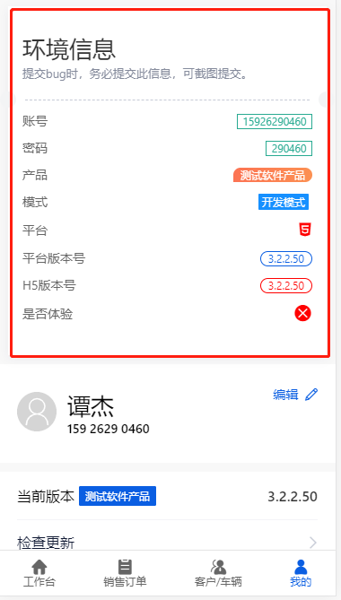

# 环境模式与测试

app 的环境总共分为以下几种
## 环境及对应启动命令

### 开发环境
```bash
npm run dev
# 会启动一个本地服务
```
### 本地开发测试
```bash
npm run dev-test
# 会打包资源到dist并起一个本地服务
```
### 内网打包测试
```bash
# 很少使用一般使用本地开发测试切换代理地址
npm run build-staging
# 会打包资源到dist（交给原生）
```
### 线上打包测试
```bash
npm run build
# 会打包资源到dist（交给原生）
```

### 发布上线打包
```bash
npm run build-release
# 会打包资源到dist（交给原生）
```
## 代理
在使用 开发环境 或 本地开发测试 时
在vue.config.js里 proxy 里切换代理地址
```js
// 代理
    proxy: {
      '/store': {
        // target: 'http://192.168.2.201:8091', // 金俊
        target: 'http://192.168.2.138:8091', // 吴敏
        // target: 'http://192.168.2.242:8091', // 测试
        // target: 'http://dp.51chebian.com', // 线上
        // target: 'http://120.79.169.8:19381', // 线上测试
        changeOrigin: true,
      }
    }
```

## 对外模式
对外分为开发模式，测试模式和生产模式
### 开发模式
```bash
# 此命令对应的开发模式
# 端口默认8080可能会变
npm run dev

```
### 测试默认
```bash
# 对应的都是测试模式
# 端口3099
npm run dev-test
# 无端口
npm run build-staging
```
### 生产模式
```bash
npm run build
npm run build-release
```
### 对外模式主要用于测试
便于复测和定位问题

如图



能让测试人员清楚当前的版本及模式，如果没有此标签则说明是生产模式

### 提交bug
1.在测试模式下测试
2.提交内容包含如上截图
3.原生问题提交给对应的开发

### 关于h5版本号的作用
1. 前面3位版本号与平台版本号保持一致

2. 后面的build号为每次合并代码执行`npm run dev-test`的时候会 `+1`

3. 禅道上的版本号以h5版本号为主，因为h5版本号不存在平台差异

4. 开发在修复bug后以当前最新的h5版本号为基础`+1`，如当前h5版本号为`3.2.2.50`修复bug后点击解决的版本为`3.2.2.51`

5. 测试人员在回归bug的时候 如果发现最新的版本为`3.2.2.50`,解决的版本为`3.2.2.51`就说明代码还没发布，如果发现版本为`3.2.2.51`或更高则证明已经修复过。